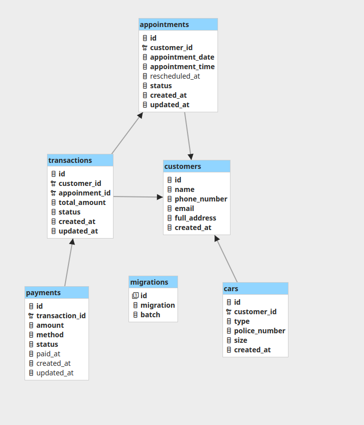

# Car Wash Booking Challenge

## Challenge Description
To ensure a smoother internship workflow, you are required to complete a simple challenge.  
As a backend developer, you need to:  
1. Design an ERD for a Car Wash Booking Website.  
2. Create the migrations using Laravel 12.  
3. Upload your work to a public repository for review.  

## Tech Stack
- Laravel 12 (PHP Framework)  
- MySQL / (database deployed on docker container)
## ERD Design
This ERD was designed with simplicity and scalability in mind. It covers the main entities needed for a car wash booking system while leaving room for future improvements.  

### Tables Overview
- **Customers**  
  Stores customer information including `name`, `phone_number`, `email`, and `full_address`. This table acts as the base for associating bookings, vehicles, and transactions.  

- **Cars**  
  Keeps records of vehicles owned by customers. Each car is linked to a `customer_id` and includes attributes such as `type`, `police_number`, and `size`.  

- **Appointments**  
  Manages booking information. Each appointment is linked to a `customer_id` and includes `appointment_date`, `appointment_time`, optional `rescheduled_at`, and `status`.  

- **Transactions**  
  Records financial data related to each appointment. Each transaction references both `customer_id` and `appointment_id`, and stores the `total_amount` and `status`.  

- **Payments**  
  Stores detailed payment information for each transaction, linked by `transaction_id`. Includes `amount`, `method`, `status`, `paid_at`, and timestamps.   

### Diagram


Oke, gua update bagian instruksi run di README lu biar konsisten dengan Docker setup dan command `make`. Hasilnya jadi kayak gini:

## 🧑‍💻 Run It on Your Own Machine

Clone the repository by using this command 
```bash
git clone https://github.com/AzzamSyakir/test-laravel-be.git
````
and use Docker to start the environment:

```bash
# Start docker containers
make up-docker
````

After the containers are up, run the database migrations:

```bash
php artisan migrate
```